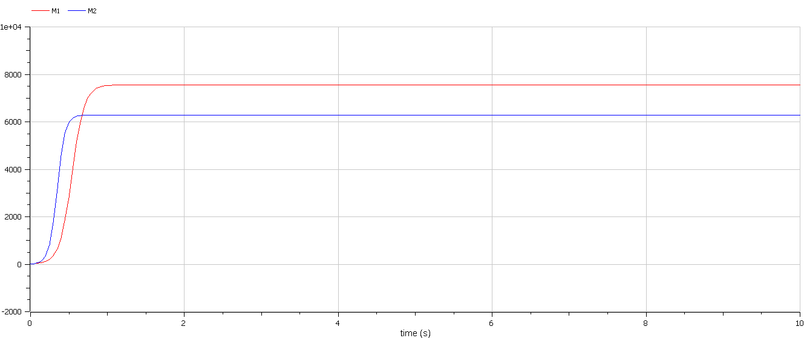
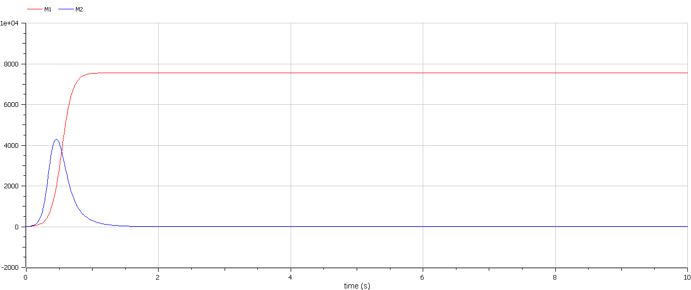

<style>
section::after {
  content: attr(data-marpit-pagination) ' / ' attr(data-marpit-pagination-total);
}
img[alt="center"] {
     display: block;
     margin: 0 auto;
}
h1 {
    font-size: 60px;
    text-align: center;
}
h2 {
    font-size: 30px;
    text-align: left;
    position: relative;
    left: -2em;
    line-height: 0px;
    top: 8em;
}
h3 {
    font-size: 40px;
    text-align: left;
    position: relative;
    left: -0.5em;
    bottom: 0.2em;
}
h4 {
    font-size: 25px;
    text-align: center;
    position: relative;
    left: -0.5em;
    bottom: 0.2em;
}
</style>

# Лабораторная работа №8
## Василий О. Худицкий 
## РУДН, 1 апреля 2022, Москва, Россия

---

# Прагматика лабораторной работы

- Знакомство с моделью  конкуренции двух фирм.

- Визуализация результатов моделирования путем построения графиков изменения оборотных средств.

---

# Цель лабораторной работы

- Научиться строить математическую модель конкуренции двух фирм.
- Научиться строить графики изменения оборотных средств двух фирм без учета постоянных издержек и с веденной нормировкой для двух случаев.

---

### Задание лабораторной работы

**Случай 1.** В этом случае динамика изменения объемов продаж фирмы 1 и фирмы 2 описывается следующей системой уравнений:

$$ \begin{cases} \frac{d M_1}{d \theta} = M_1 - \frac{b}{c_1} M_1 M_2 - \frac{a_1}{c_1} M_1^2 \\ \frac{d M_2}{d \theta} = \frac{c_2}{c_1} M_2 -\frac{b}{c_1} M_1 M_2 - \frac{a_2}{c_1} M_2^2 \end{cases}, $$

Также введена нормировка $t=c_1\theta$.

**Случай 2.** В рамках рассматриваемой модели динамика изменения объемов продаж фирмы 1 и фирмы 2 описывается следующей системой уравнений:

$$ \begin{cases} \frac{d M_1}{d \theta} = M_1 - \frac{b}{c_1} M_1 M_2 - \frac{a_1}{c_1} M_1^2 \\ \frac{d M_2}{d \theta} = \frac{c_2}{c_1} M_2 - (\frac{b}{c_1} + 0.00025)M_1 M_2 - \frac{a_2}{c_1} M_2^2 \end{cases} $$

---

# Результаты выполнения лабораторной работы

---

# Случай 1

```Modelica

 equation
 s_1 = (c1*a2-b*c2)/(a1*a2-b*b);
 s_2 = (a1*c2-b*c1)/(a1*a2-b*b);
 teta = time/c1;
 der(M1)/der(teta)=M1-(b/c1)*M1*M2-(a1/c1)*M1^2;
 der(M2)/der(teta)=(c2/c1)*M2-(b/c1)*M1*M2-(a2/c1)*M2^2;
 
```

---

#### 
##### Рис.1 График изменения оборотных средств двух фирм для случая 1

---

# Случай 2

```Modelica
 equation
 teta = time/c1;
 der(M1)/der(teta)=M1-(b/c1)*M1*M2-(a1/c1)*M1^2;
 der(M2)/der(teta)=(c2/c1)*M2-(b/c1+0.00025)*M1*M2-(a2/c1)*M2^2;
```

---

#### 
##### Рис.2 График изменения оборотных средств двух фирм для случая 2

---

# Выводы
- Научился строить модель конкуренции двух фирм.
- Научился строить графики изменения оборотных средств двух фирм без учета постоянных издержек и с веденной нормировкой для двух случаев.
